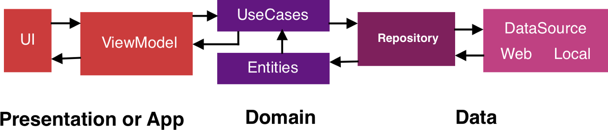
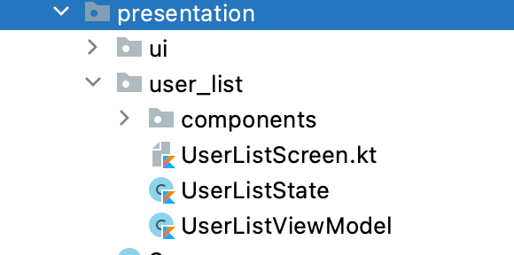
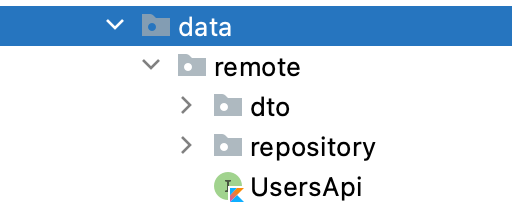
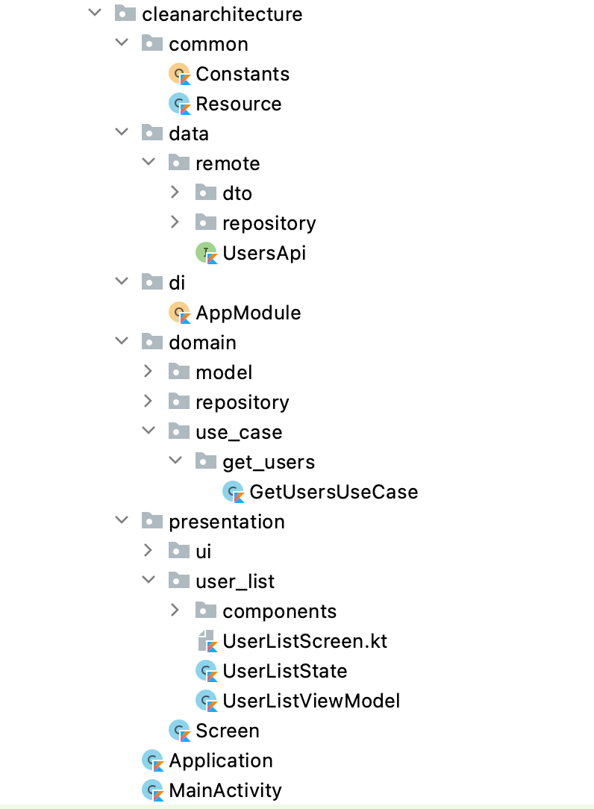

# CleanArchitecture

## Is Clean Architecture only MVVM ? 

NO, MVVM is a part of clean architecture. MVVM includes Model, View and ViewModel and in addition to this, Clean architecture has one more layer which is **USE CASES**.

What is a **USE CASE** & Why do we need them ? 

In MVVM, we use to put all our business logic into our ViewModels but the problem with that is, the bigger your project gets, 
the more number of ViewModels you have and all your business logic is divided into various viewModels. 
That’s where clean architecture comes into the picture, we use **USE CASES** instead of ViewModels for all our Business logic. 

Now, we understood why do we need use cases? **But What are Use Cases?**

Use case is an **_action we can do within a feature_**. 

For ex. We have feature called “Profile” which can have actions such as 
- Getting user profile data
- Updating user profile photo
- Editing user profile

All the above are USE CASES of a feature. 

**Advantages of Use Cases** : 

1. **Helps removing code Duplication** : Now if we want to get User Profile data in two different ViewModels, we can easily call one method from our USE_CASE class instead of putting the same method in two separate ViewModels.

2. **Screaming Architecture** : The term “screaming architecture” is used when we can, just by looking at a new project at a glance, get the core idea of what the project does and what it is about. Similarly, Use Case should be made in a way that anyone can understand just by looking at the class name that what it does . For ex. GetUsersUseCase is used to get list of users from a data source. 

**HOW SHOULD YOU DIVIDE YOUR PROJECT ?**

The code is divided into three separate layers:

1. **Presentation Layer** which includes all UI stuff, Composables, XMLs, Views & ViewModels. 

2. **Domain Layer** contains our Business Logic (most important our USE CASES) 

3. **Data Layer** contains our data, all our Databases and Repository Implementation.

-----------------------------------------------------------------------------------------

